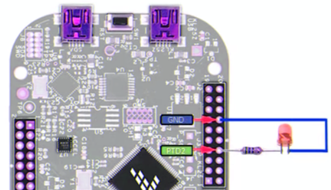
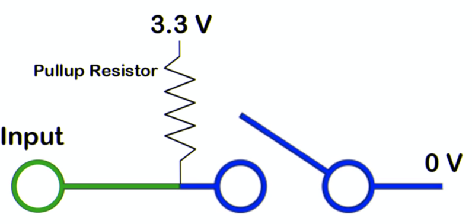

GPIO
----
***

> [⇧ **Home**](https://github.com/iotkitv4/intro)

Allzweckeingabe/-ausgabe (engl. GPIO - General Purpose Input/Output) ist ein allgemeiner Kontaktstift (Pin) an einem Mikrocontroller, dessen Verhalten, unabhängig, ob als Eingabe- oder Ausgabekontakt, durch logische Programmierung frei bestimmbar ist. GPIO-Kontakten ist kein Zweck vorgegeben, sie sind daher standardmäßig unbelegt.

Mittels folgender Grundklassen kann den GPIO Pins ein Zweck vorgegeben werden:

* [DigitalOut](#DigitalOut) -  Pin zwischen 0 (0 Volt) und 1 (3.3 Volt) hin und her schalten.
* [DigitalIn](#DigitalIn)  - liefert je nach Spannung: 0 Volt eine 0 oder 3.3 - 5 Volt eine 1.
* [AnalogIn](#AnalogIn)    - Umsetzung eines Analogssignals in einen Wert.
* [PwmOut](#pwmout---pulsweitenmodulation) -  Pulsweitenmodulation für die Erzeugung einer elektrische Spannung zwischen Ground (0 Volt) und 3.3 Volt.

Standard Pins sind mit **D0 - D15**, **A0 - A5** (analog Arduino) oder **PTxx** gekennzeichnet. **RX/TX**, **SDA,SCL** und **SS, MOSI, MISO, SLCK** sind Pins für Bussysteme. 
Daneben sind  Pin mit Ground (**GND**) und +5 Volt (**+5V**) vorhanden um die Verkabelung von externen Sensoren und Aktoren zu vereinfachen.

**Weitere Beispiele**

* [Encoder Switch](#encoder-switch) - zählt die Impulse am Encoder und schaltet einen Zähler vor und zurück.
* [Übungen](#Übungen)

## DigitalOut
***

> [⇧ **Nach oben**](#gpio)

Sinnbildliche Darstellung für den Anschluss eines LEDs. Der Name des Pins ist entsprechend Anzupassen.

- - -

Mittels DigitalOut kann ein Pin zwischen 0 (0 Volt) und 1 (3.3 Volt) hin und her geschaltet werden.

**Definition**

	DigitalOut led1( <GPIO-Pin Name> );
	
**Ansteuerung**

On

	led1 = 1;
	led1.write( 1 );

Off
	
	led1 = 0;
	led1.write( 0 );
	
Beide Varianten bei On/Off geben das gleiche Ergebnis. Die LED wird ein- und ausgeschaltet. Die erste Variante verwendet [Operator Overloading von C++] und die zweite die Methode `write`.

### Anwendungen 

*   Ansteuerung von LEDs, z.B. für Taschenlampe, [Kultpfunzel](http://kultpfunzel.ch/) , [Fernsehsimulator,](http://www.pearl.ch/ch-a-NC5312-3110.shtml) [Kleidung](http://www.get-a-led.de/led-t-shirts/led-kleidung-stereo-mc/), Statusanzeigen etc.
*   2 DigitalOut für die Richtungsbestimmung bei Motoren
*   4 DigitalOut für die Ansteuerung von Schrittmotoren

Siehe auch: [mbed Handbook](https://os.mbed.com/docs/mbed-os/latest/apis/digitalout.html) und [YouTube Tutorial](https://www.youtube.com/watch?v=kP_zHbC_5eM)

### Beispiel(e)

Das Beispiel [DigitalOut](main.cpp) steuert die LEDs 1 - 4 nacheinnander an.

## DigitalIn
***

> [⇧ **Nach oben**](#gpio)

Schematische Darstellung: Anschluss eines Buttons
- - -

DigitalIn liest den Status eines Pins (als Input Bezeichnet) aus.

DigitalIn liefert je nach Spannung: 0 Volt eine 0 oder 3.3 - 5 Volt eine 1.

Damit Eindeutig zwischen 0 und 1 unterschieden werden kann, wird in der Regel mit PullUp Widerständen gearbeitet. Dies kann durch den internen PullUp Widerstand (zweiter Parameter bei DigitalIn, Default = ON).

### Anwendungen 

*   Externer Feedback, z.B. Taster.
*   Sensoren welche bei Eintreten eines Ereignisses zwischen 0 und 1 umschalten, z.B. Bewegungsmelder

**Siehe auch:** [mbed Handbook](https://os.mbed.com/docs/mbed-os/latest/apis/digitalin.html) und [YouTube Tutorial](https://www.youtube.com/watch?v=XmWqP8laxxk)

### Beispiel(e)

Das Beispiel frägt den Taster vom Button ab.

main.cpp
  

    /** DigitalIn liest den Status eines Pins aus.
    */
    #include "mbed.h"

    DigitalIn button1( MBED_CONF_IOTKIT_BUTTON1, PullUp );
    DigitalOut led1( MBED_CONF_IOTKIT_LED2 );

    // Wartezeit
    #define WAIT_TIME    100   

    int main()
    {
        while   ( 1 ) 
        {
            led1 = 0;
            if  ( button1 == 0 ) 
            {
                led1 = 1;
                thread_sleep_for( WAIT_TIME );
            }

        }
    }

